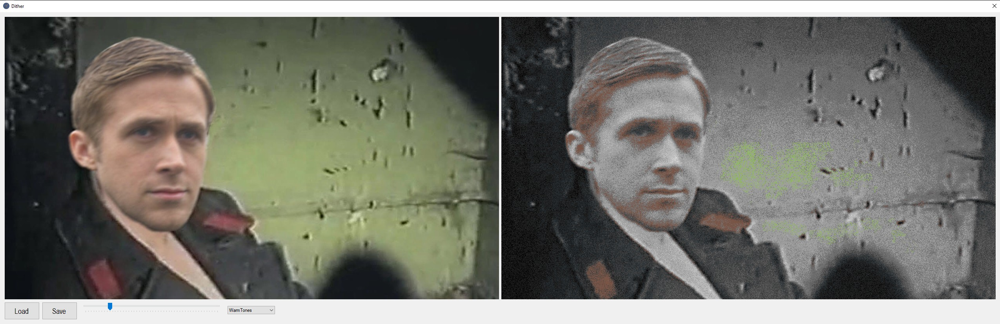
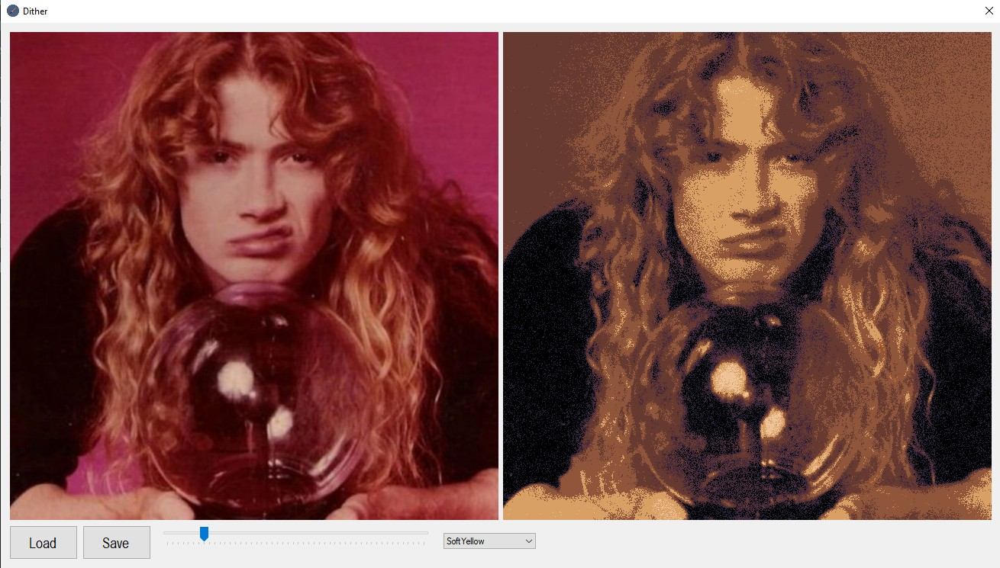

```
█ ▄▄  ▄███▄   █     ▄███▄      ▄   ▄█   ▄   █▀▄▀█ 
█   █ █▀   ▀  █     █▀   ▀      █  ██    █  █ █ █ 
█▀▀▀  ██▄▄    █     ██▄▄    ██   █ ██ █   █ █ ▄ █ 
█     █▄   ▄▀ ███▄  █▄   ▄▀ █ █  █ ▐█ █   █ █   █ 
 █    ▀███▀       ▀ ▀███▀   █  █ █  ▐ █▄ ▄█    █  
  ▀                         █   ██     ▀▀▀    ▀   
                                                  
██▄   ▄█    ▄▄▄▄▀ ▄  █ ▄███▄   █▄▄▄▄              
█  █  ██ ▀▀▀ █   █   █ █▀   ▀  █  ▄▀              
█   █ ██     █   ██▀▀█ ██▄▄    █▀▀▌               
█  █  ▐█    █    █   █ █▄   ▄▀ █  █               
███▀   ▐   ▀        █  ▀███▀     █                
                   ▀            ▀                 
                                                  
```
# Дизер изображений в разных палитрах цветов

### [Скачать](https://github.com/PELENIUM/Dither/releases/download/Release/Dither.exe)

### Пример работы




#
### Имеется:

- Регуляция уровня шума
- Выбор палитры
- Выбор и сохранение картинки

### В планах:
- Добавить возможность составлять свои палитры
- Оптимизация
- Улучшение интерфейса

Вдохнолялся https://github.com/turborium/Dither3/
